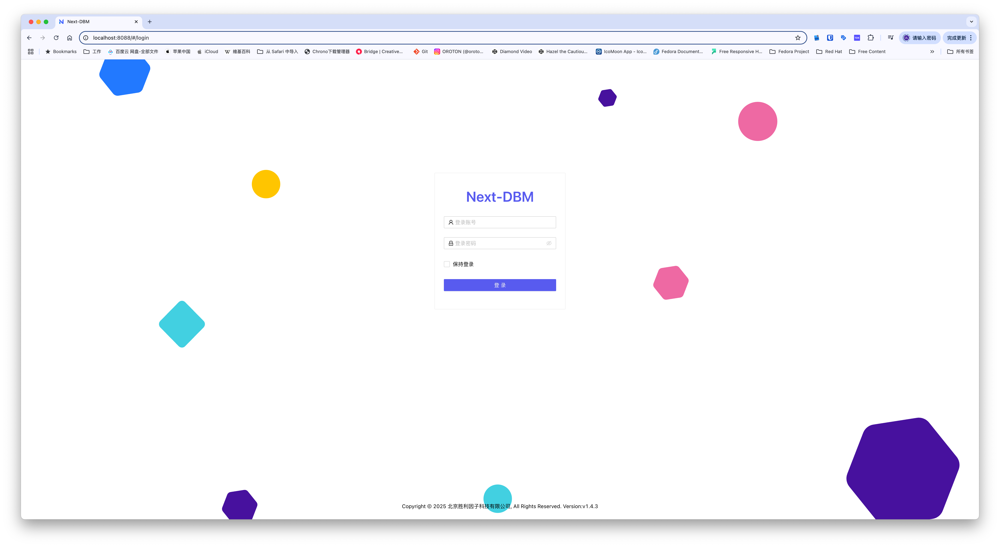
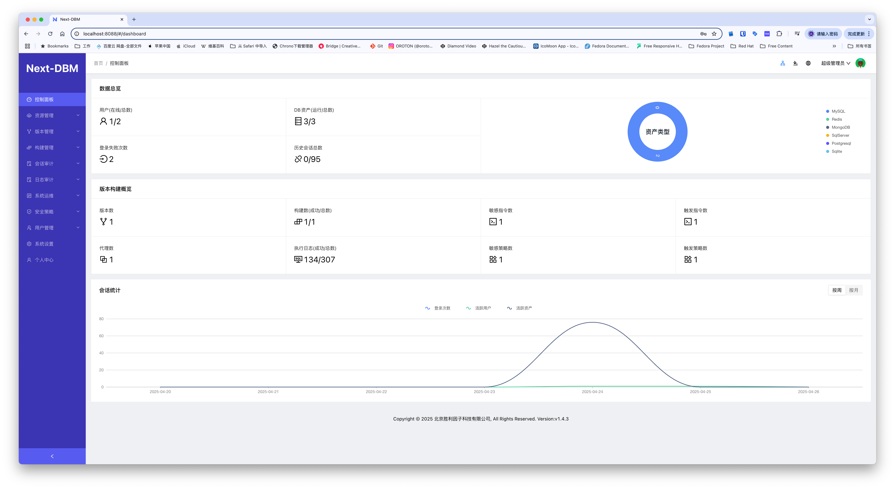
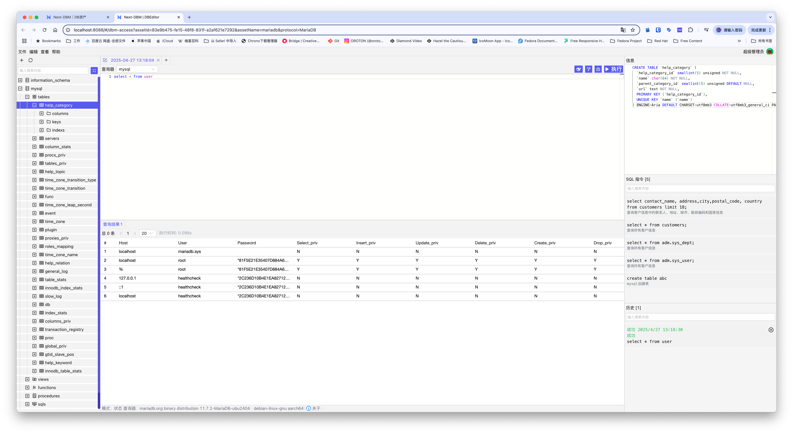
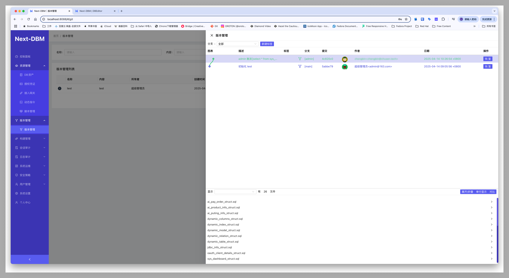
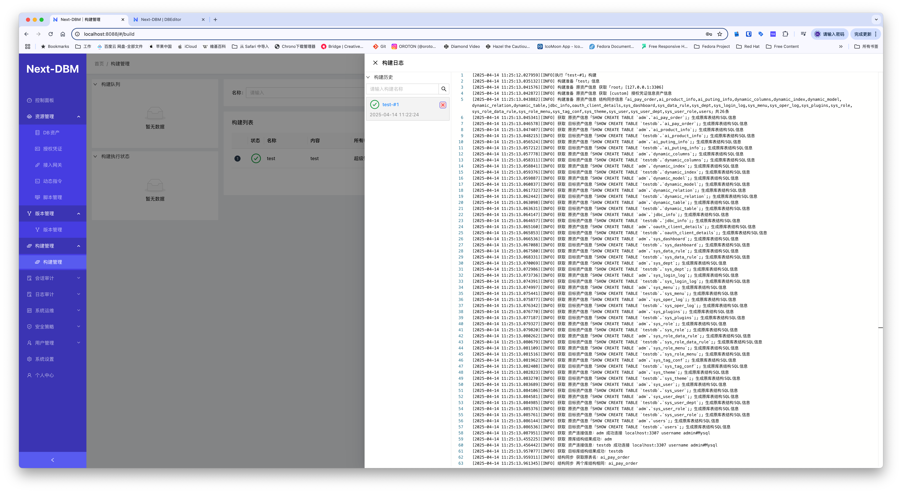
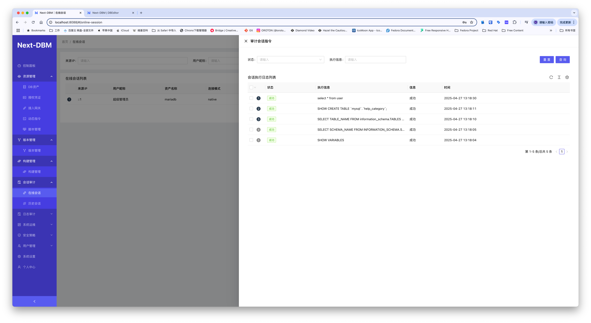
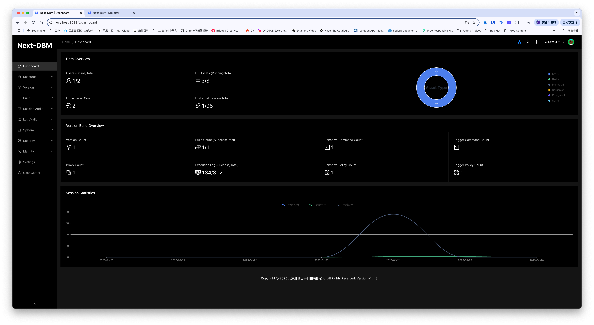
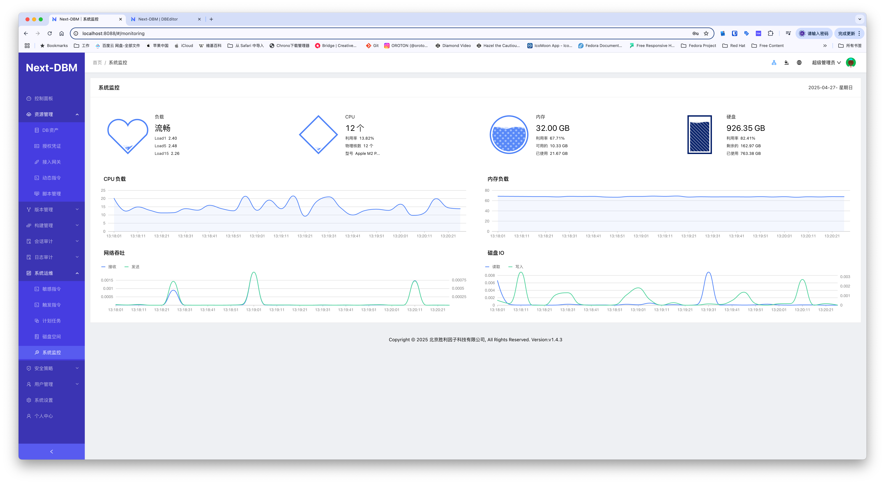

# Next-DBM

## 开始

企业轻量级数据库审计版本管理系统
Next DBM 支持数据库连接日志审计，代理权限统一管理。
支持数据版本管理。支持数据库脚本自动构建部署实施。
支持WEB操作数据库基本管理功能。

## 项目名称
Next-DBM 企业轻量级数据库审计版本管理系统

## 项目描述
项目介绍

1.支持多种数据库连接​  
支持多种数据代理连接，可以使用常用dBMS进行连接，支持MySQL、MariaDB、Oracle、SQLServer、PostgreSQL、MongoDB、Redis、MSSQL、MongoDB、客户端连接Next-DBM代理端口实

​2.支持WEB与代理服务  
​智能分片续传​：支持TB级文件断点续传，网络波动自动重试，传输稳定性达99.99%  
​带宽动态调控​：根据业务优先级智能分配传输资源，关键业务带宽保障 

​3.支持版本管理  
​光驱刻录审计​：记录光盘刻录内容、操作人员及设备信息，支持刻录前敏感内容扫描  
<!-- ​USB设备鉴权​：对接加密U盾体系，非授权外设自动阻断并告警 -->

​4.支持构建恢复数据库  
​跨网闸同步​：通过安全摆渡机制实现内外网文件受控交换 

​5.敏感指令过滤  
​多维度扫描引擎​：内置多种文件格式解析能力  
​敏感规则库​：预置金融、法律、医疗等行业特征规则，支持正则表达式自定义  
​AI增强分析​：支持 deepseek 内网独立部署接口 基于NLP的上下文语义识别，误报率低于0.5% 

​6.出发指令版本构建  
​大模型行为预测​：通过Transformer架构分析用户操作模式，实时预警异常文件流转  
​智能分类标签​：自动生成文件密级标签，准确率超95%  
支持自定义敏感规则，可以调教验证敏感规则与AI模型符合程度。 

​7.支持自主表结构与表数据版本控制  
​多级告警通知​：邮件通道分级告警  
​可视化仪表盘​：实时展示全网文件流转热力图与风险事件分布 

​8.统一身份管理​  
​LDAP/AD深度集成​：同步组织架构与职务属性，权限变更实时生效  
​RBAC权限模型​：细粒度控制到文件级访问、编辑、分享权限 
 

## 徽章标识
无

## 视觉示例

## 安装指南
内网独立安装部署请微信扫码知识星球持续完善中。

## 使用示例
无

## 支持渠道
提供社区支持

微信群支持

邮件: business@aiputing.com

## 发展路线

## 下载地址
下载地址:https://f.aiputing.com/?p=Next-DBM%2F

## 致谢名单
 

## License
保留版权

版权: 北京胜利因子科技有限公司

官网: https://license.aiputing.com
## 项目状态
交付发布

