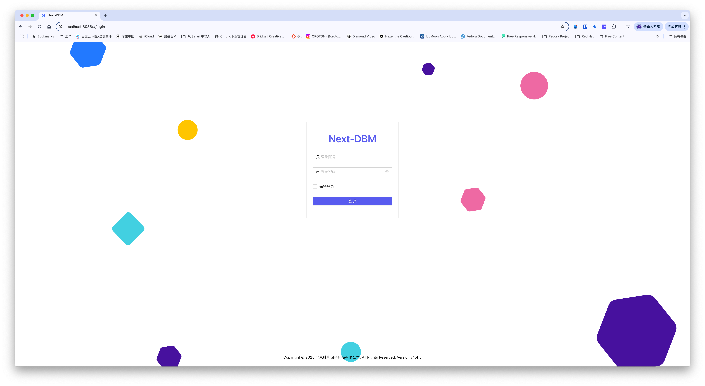
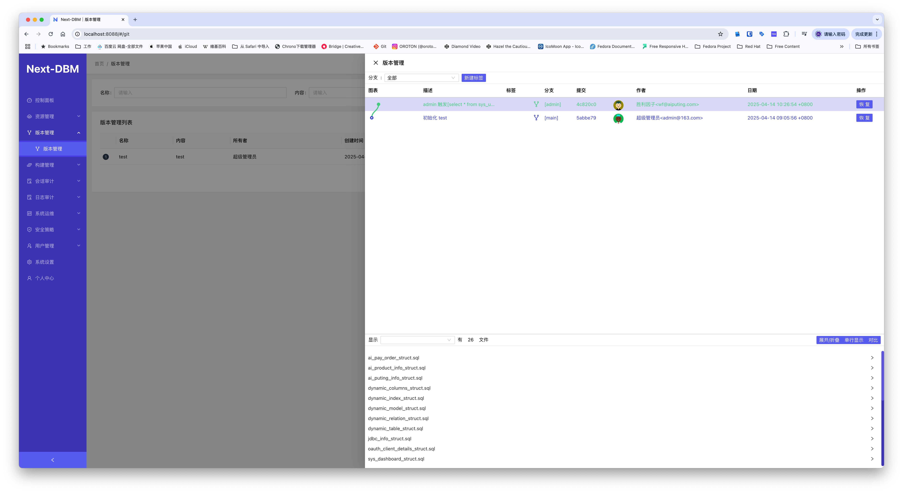

# Next-DBM

[English](README.md) ｜ [中文](README_zh.md)

## 开始

企业轻量级数据库审计版本管理系统
Next DBM 支持数据库连接日志审计，代理权限统一管理。
支持数据版本管理。支持数据库脚本自动构建部署实施。
支持WEB操作数据库基本管理功能。

## 项目名称
Next-DBM 企业轻量级数据库审计版本管理系统

## 免费体验公测
扫码进QQ群体验

## 项目描述
项目介绍

1.支持多种数据库连接​  
支持多种数据代理连接，可以使用常用dBMS进行连接，支持MySQL、MariaDB、Oracle、SQLServer、PostgreSQL、MongoDB、Redis、MSSQL、MongoDB、客户端连接Next-DBM代理端口实

​2.支持WEB与代理服务  
可以通过WEB操作数据库基本管理功能， 
使用代理TCP连接，支持连接状态查看命令查看进行审计管理。

​3.支持版本管理  
通过将SQL语句保存SQL文件进行git版本管理。将关键核心表结构与数据通过版本服务器的方式管理起来。

​4.支持构建恢复数据库  
可以在历史版本中恢复数据库。支持恢复新数据库与原库数据库进行恢复。

​5.敏感指令过滤  
支持自定义敏感规则，敏感规则组实现账号或用户组根据不同情况配置控制敏感指令。

​6.出发指令版本构建  
支持配置触发指令实现版本备份管理。如可以配置alter、insert、update、delete指令实现版本控制。

​7.支持自主表结构与表数据版本控制   
支持版本按表结构与数据过滤实现版本备份管理历史版本管理功能。

​8.统一身份管理​    
​LDAP/AD深度集成​：同步组织架构与职务属性，权限变更实时生效  
​RBAC权限模型​：细粒度控制到文件级访问、编辑、分享权限 

9.代理服务管理   
支持按不同数据库常用端口分别控制管理
 
10.更多设置功能  
国际化多语言支持，主题切换
 
## 徽章标识
无

## 视觉示例

## 安装指南
内网独立安装部署请微信扫码知识星球持续完善中。

## 使用示例
无

## 支持渠道
提供社区支持

微信群支持

邮件: business@aiputing.com

## 发展路线

## 下载地址
下载地址:https://f.aiputing.com/?p=Next-DBM%2F

## 致谢名单
 

## License
保留版权

版权: 北京胜利因子科技有限公司

官网: https://license.aiputing.com
## 项目状态
交付发布

